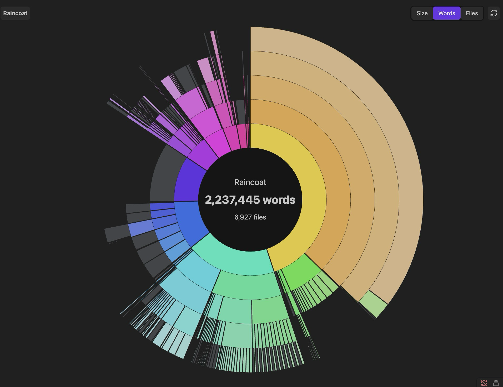

# Vault Sunburst - Disk Usage

[](https://github.com/n23eos/obsidian-vault-sunburst/releases/latest)
[](https://github.com/n23eos/obsidian-vault-sunburst/stargazers)
[](LICENSE)

**Vault Sunburst charts an entire Obsidian vault as an interactive sunburst, in the spirit of classic disk-usage analyzers.** One chart switches between three metrics: size on disk in bytes, word count in notes, and number of files. Clicking a folder flies into it with animated zoom, while the center, Esc or the breadcrumbs go back up and clicking a file opens it. Sectors morph when the metric changes, hovering highlights a folder together with all its descendants, and the DaisyDisk-style rainbow palette follows the on-screen angle in both light and dark themes. Available in 13 languages, on desktop and mobile.

> ### ⭐ Star this repo
> If Vault Sunburst helps you make sense of your vault, [give it a star](https://github.com/n23eos/obsidian-vault-sunburst) — it takes a second and helps other Obsidian users find the plugin.



## Features

- **Three metrics, one chart** — switch instantly between:
  - **Size** — sectors proportional to disk usage (bytes);
  - **Words** — sectors proportional to word count in your notes;
  - **Files** — sectors proportional to the number of files.
- **Animated zoom** — click a folder to fly inside it; click the center, press <kbd>Esc</kbd>, or use the breadcrumbs to go back up. Click a file to open it.
- **Smooth transitions everywhere** — sweep-in intro, sector morphing when switching metrics, hover highlighting of a folder with all its descendants.
- **DaisyDisk-style rainbow palette** — hue follows the on-screen angle, outer rings fade gently. Works in both light and dark themes.
- **Small-file grouping** — sectors too thin to see are merged into a single muted "small items" arc, so the chart stays clean at any scale.
- **Context menu** — right-click a sector: zoom in, open in a new tab, copy path, show in system explorer.
- **Live updates** — the chart rescans automatically when your vault changes (debounced), plus a manual refresh button. Word counts are cached by modification time, so rescans are fast even in large vaults.
- **CJK-aware word counting** — Chinese and Japanese text is counted per character, so word counts are meaningful without spaces.

## Languages

The UI follows your Obsidian language automatically. 13 languages included:
English, Русский, Українська, Deutsch, Français, Español, Italiano, Português, Polski, Türkçe, 中文, 日本語, 한국어.

Plural forms and number formatting follow CLDR rules (`Intl.PluralRules`, `toLocaleString`).

## Settings

- **Excluded folders** — one vault path per line; skipped entirely during scanning (handy for `attachments` and similar).
- **Ring count** — how many nesting levels the chart shows at once (3–8).

## Install

### From Community Plugins

Once accepted into the directory: Settings → Community plugins → Browse → search for **Vault Sunburst**.

### Manual

1. Download `main.js`, `manifest.json`, `styles.css` from the [latest release](https://github.com/n23eos/obsidian-vault-sunburst/releases/latest).
2. Put them into `<your vault>/.obsidian/plugins/vault-sunburst/`.
3. Reload Obsidian and enable **Vault Sunburst** in Settings → Community plugins.

Open the chart via the pie-chart ribbon icon or the **Open vault chart** command.

## Development

```bash
npm install
npm test        # vitest — 27 tests over the pure modules (layout, geometry, i18n, word counting)
npm run build   # tsc + esbuild → main.js
npm run dev     # watch mode
```

The zoom is implemented the "zoomable sunburst" way: the angular layout is computed once per metric, and zooming only animates the view window — so navigation stays smooth even in vaults with thousands of files.

## License

[MIT](LICENSE)

---

## По-русски

Интерактивная круговая диаграмма хранилища в стиле DaisyDisk: три режима (размер на диске / количество слов / количество файлов), анимированный зум по папкам, контекстное меню, автообновление, исключение папок и 13 языков интерфейса. Язык подхватывается из настроек Obsidian автоматически.

⭐ Если плагин оказался полезен — [поставьте звезду репозиторию](https://github.com/n23eos/obsidian-vault-sunburst), так его найдут другие.

## More projects

### Obsidian plugins

| Plugin | What it does |
| --- | --- |
| [Graph Insight](https://community.obsidian.md/plugins/graph-insight) | Explore large vaults as an interactive graph. |
| [Always-on-Top Tasks](https://community.obsidian.md/plugins/tasks-for-focus-adhd) | Keep a note and its tasks in a focused floating overlay. |
| [Column Explorer](https://community.obsidian.md/plugins/column-explorer) | Browse a vault with Finder-style Miller columns. |
| [Vault Sunburst](https://community.obsidian.md/plugins/vault-sunburst) | Visualize folder sizes, word counts and file counts. |
| [Vault Telegram Bridge](https://community.obsidian.md/plugins/vault-telegram-bridge) | Capture Telegram messages and media in an Obsidian vault. |

### Browser extensions

| Extension | What it does |
| --- | --- |
| [FloatPlayer - Picture in Picture](https://chromewebstore.google.com/detail/floatplayer-%E2%80%94-picture-in/colaiiadempclbkepfnojfggmpcadadg?authuser=0&hl=ru) | Keep YouTube video in a floating picture-in-picture player. |
| [Eye Rest 20-20-20](https://chromewebstore.google.com/detail/eye-rest-20-20-20/gfffpnlfldimcjnkgleknfheojoncama?authuser=0&hl=ru) | Gentle 20-20-20 reminders for your eyes. |

## Поддержать проект

Если плагин оказался полезен, можно поддержать его развитие:

[](https://etherscan.io/address/0x77777da54702AC8789D53fc7cC6201C29a1A88C4)[](https://etherscan.io/address/0x77777da54702AC8789D53fc7cC6201C29a1A88C4)

[](https://ko-fi.com/n23eos)
